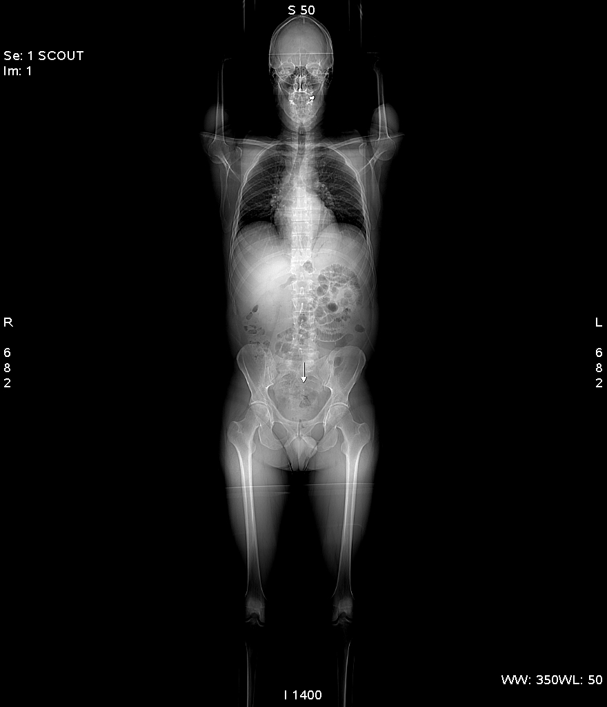
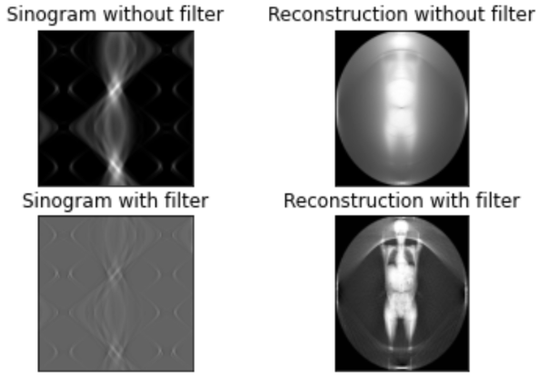
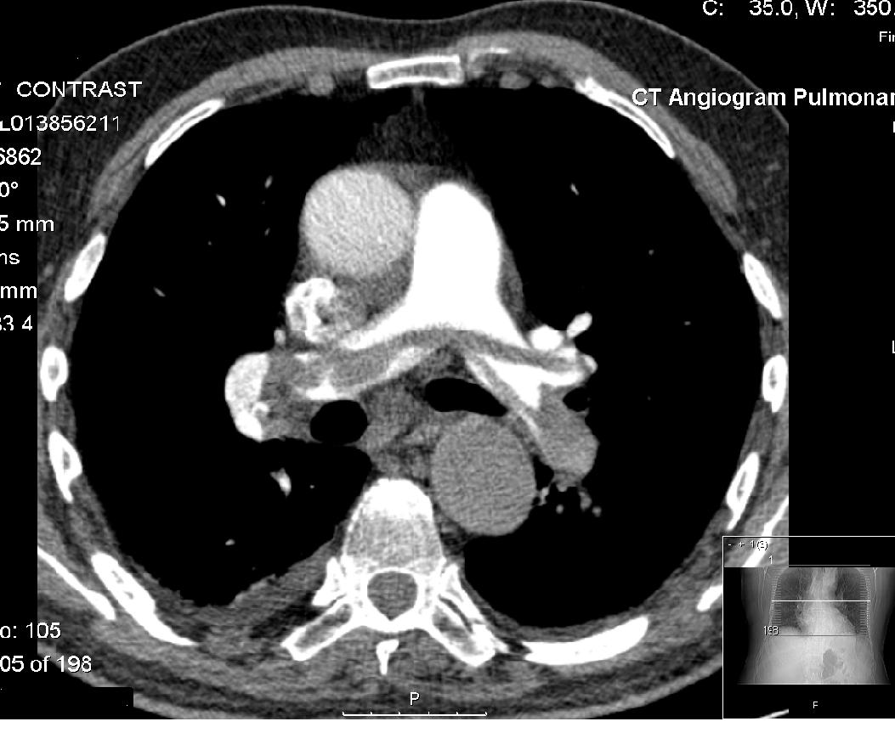
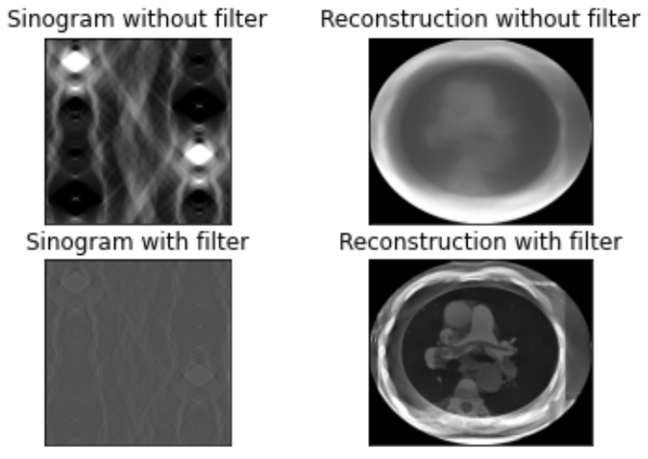

# Computed tomography
## Table of contents
* [Description](#description)
* [Used libraries](#used-libraries)
* [Our approach](#our-approach)
* [Results](#results)

## Description
This project was a part of a Informatics in Medicine university class. The idea was to implement a filtered back projection algorithm.

## Used libraries
- numpy
- opencv
- matplotlib & seaborn
- streamlit
- pydicom
- scikit-image
- scikit-learn

## Our approach
We used a parallel tomography model in which there are *n* emitters and detectors placed right in front of each other.

The distance between emitters/detectors is fixed and is equal to $l/n$. The rotation angle is equal to $\alpha$.

To find which points are on the line between a pair of an emitter and a detector, we used a [bresenham](https://en.wikipedia.org/wiki/Bresenham%27s_line_algorithm) algorithm. The average value of all the points of the line is then one pixel of a sinogram. We later applied convolution on the sinogram and normalized it.

The reconstruction is done by applying the inverse Radon transform.

## Results
### CT_ScoutView
#### Input

#### Reconstruction

### SADDLE_PE
#### Input

#### Output
